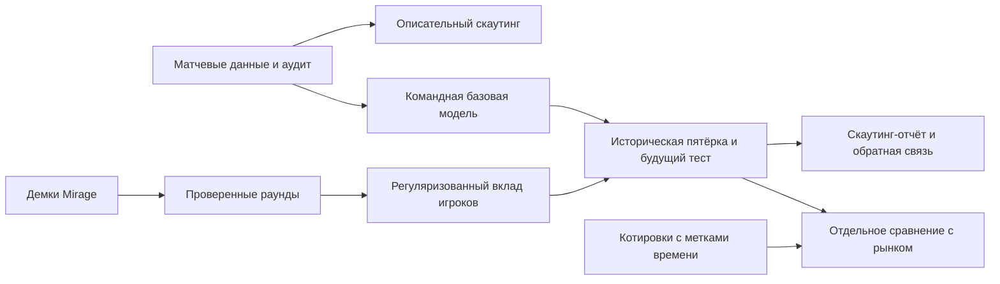

# CS2 Player Rating — Pipeline и метрики проекта

2026-09-20 · @Someone · редакция после аудита локального MVP и новой загрузки данных

## Цель и проверяемая гипотеза

Цель — исследовать форму игроков CS2 и помочь находить кандидатов для скаутинга. Следующий эксперимент: улучшает ли информация о пяти игроках предматчевые вероятности относительно командных Glicko-2 и логистической регрессии на одинаковой будущей выборке?

Рабочая гипотеза: прошлые показатели игроков и исторический состав дают добавочную предсказательную ценность. Подтверждение — устойчивое улучшение log loss / Brier на нескольких временных окнах с оценкой неопределённости. Отличие от чужого рейтинга или красивый лидерборд сами по себе гипотезу не подтверждают.

B2B-скаутинг — возможное применение. Сравнение с закрывающей линией — отдельный эксперимент, требующий данных котировок. Оно не является обязательным условием полезности скаутинга. Публикация, обращения к командам и платные сервисы пока не выполняются.

## Что уже есть: фактический статус

**MVP работает.** Node.js 24+, локальный интерфейс, SQLite, бесплатные коннекторы, исторические встречи, прогноз команд, шесть сравниваемых моделей и временная проверка. Новые разделы: «Скаутинг», «Готовность данных», «Вклад игроков» и «Рынок и карты».

Срез `data/reports/bo3-research.json` от 20.09.2026:

| Показатель | Факт |
| --- | ---: |
| Матчи BO3 | 44 016 |
| Период | 27.09.2023–19.09.2026, с выхода CS2 |
| Матчи со статистикой игроков | 5 444 — 12,37% всей истории |
| Матчи с ровно 5 уникальными игроками на каждой стороне | 5 213 |
| Уникальные игроки | 2 970 |
| Строки игрок × матч | 55 134 |
| Пропуски K/D/ADR среди имеющихся строк | 0% |
| KAST / первые убийства / первые смерти | 53 361 строка для каждого поля |
| Trade kills / traded deaths после восстановления из кэша | 52 877 строк для каждого поля |
| Flash assists | 1 773 строки |
| Utility damage | Нет данных |
| Карты Mirage с итоговым счётом | 9 125 |
| Импортированные раунды / полные демки Mirage | 0 / 0 |
| Подтверждённая разметка ролей / closing odds | Нет / нет, импорт готов |

Подробная статистика сейчас покрывает март–сентябрь 2026 года; за 2023–2025 годы её пока нет, помесячный добор идёт в фоне. Поэтому 44 тысячи результатов нельзя выдавать за 44 тысячи матчей для player-level обучения. Покрытие меняется по месяцам; оно не является случайной выборкой. Отсутствие пропусков в загруженных строках не устраняет смещение отбора.

Из уже сохранённых ответов API восстановлены дополнительные поля в 4 716 матчах, без сетевых запросов. Перед изменением создана SQLite-копия в `data/backups/`. Исходные показатели и результаты сохранены. Агрегаты серии нельзя честно превратить в показатели конкретной карты или раунда.

## Pipeline и критерии перехода

| Этап | Выход | Проверяемый критерий | Статус |
| --- | --- | --- | --- |
| 1. Гипотеза и командная база | Glicko-2, Elo, логистическая регрессия, временной backtest | Воспроизводимый отчёт и защита от будущих исходов | Реализовано |
| 2a. Матчевые данные игроков | Показатели, составы, покрытие по времени, описательная форма | Известны пропуски, идентичности и смещение выборки | Реализовано, охват неполный |
| 2b. Раунды одной карты | Проверенные раунды Mirage и происхождение демо | ≥300 различных матчей с полной Mirage; нет неполных импортированных Mirage; <5% раундов с пропуском стартовой экономики | 0/300, нужны демки и парсер |
| 3. Player-модель | Регуляризованная модель вклада и неопределённость | Стабильность по временным окнам, проверка идентифицируемости, улучшение относительно базовой модели на новых данных | Обучена на сериях; улучшения над базой нет |
| 4. Team-модель | Прогноз по исторической пятёрке и доступному контексту | Парные Δlog loss / ΔBrier на одной выборке; bootstrap по матчам/турнирам, будущий период зафиксирован заранее | Командная база есть; player-признаки ещё не включены |
| 4b. Проверка против рынка | Модель и очищенные от маржи closing probabilities | Одинаковые исходы, время снимка до старта, одинаковые матчи и неопределённость разницы ошибок | Инфраструктура и тесты готовы; котировок нет, нужен ключ OddsPapi |
| 5. Скаутинг-продукт | Объяснимый отчёт с ограничениями | Рабочая цель: 5 интервью со штабами, минимум 2 конкретных полезных кейса; пороги согласовать до исследования | Локальный прототип, feedback не собран |
| 6. Решение | Продолжить, изменить гипотезу или закрыть | Повторяемая полезность и готовность хотя бы одного клиента платить; иначе документированный no-go | Не начато |

300 матчей — стартовый порог качества набора, а не доказанная достаточность для тысяч коэффициентов игроков. Размер выборки, связность составов и вариативность соперников важнее одной цифры.



## Карты: первый признак, который прошёл проверку

Отдельный эксперимент на уровне карты, условный на уже известную карту. Базовая модель — Elo и сглаженный винрейт команды; вторая добавляет Elo, винрейт и опыт команды на этой карте. Тест — 11 458 карт с 21.03.2026: Brier 0,2330 → **0,2305**, log loss 0,6580 → **0,6524**, accuracy 60,41% → **61,12%**. ΔBrier **−0,0025**, 95% интервал по недельным блокам **[−0,0039; −0,0011]** целиком ниже нуля; прирост на 7 из 8 основных карт. Среди признаков карты самый тяжёлый вес у опыта на ней: команды чаще играют свои карты, потому что сами их пикают.

Это не бэктест ставок на карту: нет timestamps veto и котировок рынков отдельных карт. Следующий шаг для идеи «пик не своей карты» — источник veto с временем и котировки map-winner.

## Реализованный индекс формы

Срез задаётся моментом `asOf`, окном в днях и минимальным числом матчей. Входят только матчи, завершившиеся строго до `asOf`; если корректного окончания нет, доступность результата откладывается на 24 часа после начала. Вес матча убывает экспоненциально с полураспадом 30 дней.

Компоненты: ADR 40%, KAST 25%, K/D 20%, доля выигранных первых дуэлей 15%. Показатели усредняются по матчам с весом давности; K/D матча = kills / max(1, deaths). Затем вычисляются z-score внутри когорты; каждый ограничивается диапазоном −3…3. Нужны минимум 3 компонента, достаточное число матчей для каждого и минимум 5 игроков в когорте с ненулевой дисперсией. Веса доступных компонентов перенормируются.

`n_eff = (Σw)² / Σw²`. Для shrinkage используется минимум из n_eff и числа матчей с данными каждого включённого компонента. Итог: `50 + 10 × n/(n+10) × средневзвешенный z-score`, ограниченный 0…100. Это эвристика, не RAPM, не вероятность победы и не доверительный интервал.

Роль задаётся вручную в `data/roles.json` с `playerId`, `role`, `from`, `to`, `evidence`. Интервалы полуоткрытые `[from, to)` и не пересекаются для одного игрока. При смене роли игрок получает отдельные строки. Без подтверждения роль остаётся `unknown` и используется общая когорта. Поддерживается одна основная метка за период; IGL может сочетаться с AWP/support в реальности, что текущая схема не отражает. Автоопределения ролей пока нет.

На текущем 90-дневном срезе: 2 260 игроков, у 928 достаточно данных для индекса, подтверждённых ролей нет. Spearman с доступным **рейтингом BO3**, не HLTV, около **0,956**. Это ожидаемо для похожих исходных показателей: новый независимый сигнал пока не доказан. Индекс не корректирует силу соперников и уровень турнира.

## План продвинутых player-метрик

Нельзя утверждать, что размены, flash assists и вклад урона отсутствуют у конкурентов: они входят в [HLTV Rating 3.0 / Round Swing](https://www.hltv.org/news/42485/introducing-rating-30). Отличия нужно проверять сравнением определений и качества на будущих данных.

| Метрика | Точное определение / ограничения | Что доступно сейчас |
| --- | --- | --- |
| Роль | Историческая разметка по карте, стороне и периоду; признаки классификатора только из прошлого. Проверить согласованность разметчиков | Ручные интервалы, файл пока не заполнен |
| Utility damage | Урон врагам от HE и огня; отдельно урон своим. Нормировать на раунды, расходы или возможности, заранее выбрав знаменатель | Нет |
| Flash support | Длительность ослепления врагов, flash assists, эффект на последующее действие; не «урон от флешей» | Flash assists частично, остальные требуют событий |
| Smoke / позиция | Контроль линий обзора, маршрутов и тайминга; navmesh-дистанция сама по себе не измеряет качество решения. Учитывать дым, окклюзию, FOV | Нет tick-level данных; уникальность сигнала не доказана |
| Trade kill share | Убийства, отомстившие за смерть тиммейта / все убийства. Для своей версии зафиксировать 3 секунды, того же убийцу и алгоритм сопоставления | Агрегат BO3; его временное окно не подтверждено |
| Traded death rate | Собственные смерти, за которые отомстил тиммейт / все собственные смерти; каждый эпизод считать один раз | Агрегат BO3, не проверенная метрика «3 секунды» |
| Opening duel win rate | Первые убийства / (первые убийства + первые смерти); поправка на соперника только по его рейтингу до матча | Сырая доля есть, поправки нет |
| Clutch conversion | Выигранные 1vX / все начавшиеся 1vX, отдельно по X, экономике и стороне | Только число выигранных клатчей, знаменателя нет |
| Economy | Стоимость экипировки на freeze end, деньги и сохранённое оружие, контекст раунда. Стратегия командная; потраченные деньги не равны эффективности | Match-level суммы spent/saved частично, стартовых раундовых значений нет |

Показатели коммуникации и решений IGL демо не раскрывает. Не следует выдавать косвенные игровые показатели за качество капитанства.

## RAPM: обучена на сериях, преимущества над базой нет

Матчевый вариант реализован и измерен: `src/rapm.js`, раздел «Вклад игроков» в приложении и на витрине, эндпоинт `/api/rapm`. Подписанные ±1 индикаторы десяти игроков, L2-штраф, λ выбирается на валидации 60–80%, тест — последние 20% матчей, метки с поздним окончанием исключены на обеих границах.

Срез от 22.09.2026 — 5 213 матчей с полными составами, тест 1 043 матча с 20.08.2026, λ = 5:

| Модель | Log loss | Brier | Accuracy | ROC-AUC |
| --- | ---: | ---: | ---: | ---: |
| RAPM по игрокам | 0,6441 | 0,2263 | 63,0% | 0,671 |
| Glicko-2 на тех же матчах | **0,6286** | **0,2195** | **64,8%** | **0,694** |

ΔBrier = **+0,0068** в пользу командной базы, bootstrap-интервал по матчам **[−0,0003; +0,0141]** едва задевает ноль. Вывод: на текущих данных знание пятёрки **не улучшает** предматчевую вероятность; различие статистически неотличимо от нуля, точечная оценка против RAPM. Причины видны в том же отчёте: 302 из 1 043 тестовых наблюдений содержат игрока без коэффициента, а 1 397 игроков полностью неотличимы от партнёров — они появляются ровно в одних и тех же наблюдениях, и L2 делит общий сигнал поровну. С ростом выборки с 4 806 до 5 213 матчей отставание не сократилось, а выросло. Это ещё не опровержение гипотезы, а следствие 12,4% покрытия статистикой и короткой предыстории составов.

Раундовый режим остаётся будущим экспериментом: раундов Mirage в базе 0, статус `insufficient_data`.

Сначала — регуляризованная логистическая модель исхода раунда: подписанные индикаторы десяти игроков, CT/T, карта и патч, стартовая экономика и заранее определённый контекст. Коэффициент игрока условен относительно остальных переменных, не является причинным эффектом замены игрока. Составы, которые постоянно играют вместе, создают сильную коллинеарность: их индивидуальные вклады могут быть неидентифицируемы.

Нужны ограничения/центрирование коэффициентов, shrinkage редких игроков, подбор регуляризации только на прошлом и интервалы неопределённости. Роли и поправка на соперника не возникают автоматически из слова RAPM. Для player-level модели требуется отдельное исследование ролей и разбиения по командам/турнирам. Достаточность 300 матчей заранее не гарантирована.

В предматчевой модели используются только прошлые значения рейтингов и известная до старта пятёрка. Экономика конкретного будущего раунда недоступна до матча: её нельзя напрямую переносить в предматчевый прогноз. Сумма раундовых коэффициентов не превращается автоматически в вероятность победы BO3; нужна отдельная агрегация и калибровка на исторических сериях.

## Проверка качества

Реализовано: chronological walk-forward, первые примерно 80% — обучение регрессии, последние 20% — оценка. Рейтинги обновляются после окончания. Обучающие метки, недоступные к первому тестовому матчу, исключаются. Изменения старых исходов и составов сбрасывают кэш модели.

Текущий командный backtest: 32 634 обучающих строки, 8 161 тестовая с 01.03.2026; ещё 9 ранних матчей исключены из fit из-за позднего окончания. Логистическая регрессия: **log loss 0,6176; Brier 0,2147; accuracy 65,43%; ROC-AUC 0,7084**. Это оценка командной модели; player-индекс в неё пока не входит. Исследованные ранее тестовые данные уже нельзя считать нетронутым подтверждающим holdout для новых гипотез.

| Метрика | Интерпретация |
| --- | --- |
| Log loss, Brier | Качество вероятностного прогноза; меньше лучше. Brier отражает и калибровку, и различающую способность |
| Калибровочная диаграмма | Фактическая частота побед против прогнозов, размер групп и интервалы неопределённости; диаграмма уже есть, интервалы ещё нет |
| ROC-AUC | Ранжирование положительных исходов независимо от порога; не проверяет калибровку, не определена при одном классе |
| Accuracy | Дополнительная метрика при пороге 0,5; равный прогноз даёт 0,5 вклада |
| Парная разница с baseline | На одних матчах, с неопределённостью и разрезами по времени/тирам/составам |
| Spearman против внешнего рейтинга | Описывает сходство ранжирования. Низкая корреляция может быть шумом; высокая не исключает полезной поправки |

До следующего эксперимента зафиксировать признаки, периоды train/validation/test и основной критерий. Раунды одного матча не должны попадать по разные стороны split. Подбор параметров, стандартизация, роли и калибровка — только на train/validation. Составы и veto использовать согласно моменту, когда они реально известны. Исторические map win rates допустимы, если посчитаны только по прошлому; итоговая статистика целевого матча — утечка.

Для рынка нужны decimal odds обеих сторон и `capturedAt < match.start`, совпадение рынка «победитель серии» и правил исхода, источник и процедура выбора последнего доступного снимка. Простой baseline без маржи: `qA=(1/oddsA)/((1/oddsA)+(1/oddsB))`. Сравнивать Brier/log loss на общей выборке. 100 матчей не гарантируют значимость. До получения котировок результата «обогнали Pinnacle» нет.

## Бесплатные источники и границы MVP

| Источник | Использование | Ограничение |
| --- | --- | --- |
| BO3 | Уже собранная история, кэш, агрегаты игроков | Неофициальный интерфейс, неполное покрытие; доступность не равна лицензии на коммерческое распространение |
| FACEIT | Коннектор истории по никам с бесплатным ключом | Отдельная популяция матчмейкинга; ключ пользователь ещё не предоставил для живой проверки |
| PandaScore | Коннектор бесплатных результатов | Детальная статистика в этом MVP не запрашивается |
| [awpy](https://awpy.readthedocs.io/en/stable/) | Кандидат для локального разбора доступных демок | Отдельная установка и адаптер ещё нужны; закрепить версию, проверять API и совместимость с патчами CS2 |
| [GRID Open Access](https://grid.gg/open-access/) | Возможный источник по одобренной заявке | Доступ к нужной истории не гарантирован; Series Events исключены из Open Access |
| HLTV / организаторы | Возможные места получения доступных демо | Доступность каждой демки и условия использования проверяются отдельно; утверждения «без лимитов» и «50 000 демо доступны» не подтверждены |
| Liquipedia | Контекст и возможные доказательства ролей | Историчность ролей, условия API и полноту проверять отдельно; готовой достоверной разметки всех игроков нет |
| История closing odds | Источник пока не выбран | Полный бесплатный исторический набор не подтверждён |

Текущий MVP работает без оплаты данных и облака. Нельзя обещать, что бесплатные источники гарантированно закроют все будущие этапы, особенно демки и closing odds. Платные подключения не добавлялись.

## Следующие действия и команды

1. Посмотреть «Готовность данных» и дополнить более раннюю статистику BO3 — для player-модели требуется предыстория, а не только свежие матчи.
2. Зафиксировать новый будущий тестовый период до экспериментов с player-признаками.
3. Проверить вручную несколько полных Mirage-демок: версия парсера, идентичности, стороны, счёт и временные метки. Затем масштабировать до 300 матчей, сохраняя список доступных/недоступных демо, без обещания охвата только топ-20.
4. Подготовить адаптер awpy в контракт ниже и проверить несколько раундов по видео/демо. Сейчас импорт принимает **готовый нормализованный JSON**, не бинарный `.dem`.
5. Создать проверенную историческую разметку ролей; проверить межэкспертное согласие. Начать RAPM только после аудита полноты и идентифицируемости.
6. Сравнить командную базу и player-признаки на одной подвыборке, затем проверить будущий период. Отдельно решать вопрос котировок и обратной связи от штабов.

```powershell
npm start
npm run research -- audit
npm run research -- enrich
npm run research -- import-rounds path/to/rounds.json
npm test
```

`audit` сохраняет отчёт в `data/reports/bo3-research.json`. `enrich` дополняет только отсутствующие дополнительные поля из локального кэша и автоматически делает SQLite backup. Повторный запуск не создаёт дубликатов. `import-rounds` проверяет весь файл, делает backup и импортирует транзакционно. Правила и примеры форматов: [RESEARCH_FORMATS.md](RESEARCH_FORMATS.md).

В этой редакции исправлены устаревший статус «MVP не начат», обещания бесплатного полного охвата, определения utility/trade/clutch, интерпретация Spearman и критерии качества. Добавлены реальные объёмы новой базы и явно отделены выполненная работа, текущие ограничения и дальнейшие эксперименты.
